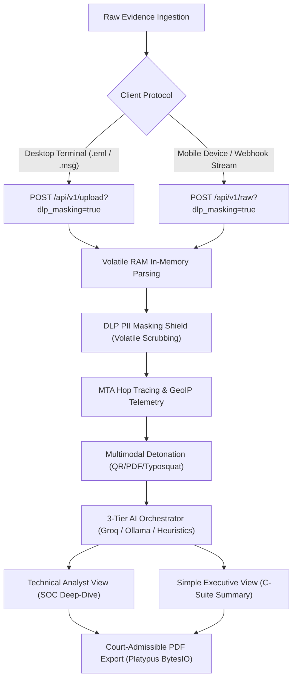

# 🚀 VAJRA Forensic Platform — Setup & Execution Runbook
> **Smart India Hackathon (SIH 2026) | Problem Statement: SIH26106**  
> **Official Lead Evaluator & SOC Architecture Verification Guide**

---

## 📋 System Prerequisites

Ensure the host demonstration system meets the following baseline requirements:

| Component | Specification | Verification Command | Notes |
| :--- | :--- | :--- | :--- |
| **Python** | `3.10` or higher (64-bit) | `python --version` | Core FastAPI, parsing engines & ReportLab |
| **Node.js & npm** | Node `18.0.0`+ & npm `9.0.0`+ | `node -v` & `npm -v` | Vite build pipeline & React 19 SOC UI |
| **Browser** | Google Chrome / Microsoft Edge | Latest Chromium release | Hardware-accelerated canvas & modern WebGL |
| **Operating System** | Windows 10/11, Linux, or macOS | System Terminal | Dual Windows CMD & PowerShell runbooks below |

---

## 🛠️ Step-by-Step Launch Instructions

To launch the full VAJRA forensic stack, open **two separate terminal windows**:
- **Terminal 1:** Python/FastAPI Asynchronous Forensic Engine
- **Terminal 2:** React 19 / Vite Cyberpunk SOC Dashboard

---

### Terminal 1: Backend Initialization (FastAPI)

#### 1. Navigate to the Backend Directory
```bash
cd D:\SIH_Final_Workspace\backend
```

#### 2. Create Virtual Environment (`myenv`)
```bash
python -m venv myenv
```

#### 3. Activate the Environment

##### Windows PowerShell:
```powershell
# Bypass execution policy restrictions for the active session if scripts are disabled
Set-ExecutionPolicy -Scope Process -ExecutionPolicy Bypass

# Activate virtual environment
.\myenv\Scripts\Activate.ps1
```

##### Windows Command Prompt (CMD):
```cmd
myenv\Scripts\activate.bat
```

##### Linux / macOS:
```bash
source myenv/bin/activate
```

#### 4. Install Forensic Backend Dependencies
```bash
python -m pip install --upgrade pip
pip install -r requirements.txt
```

#### 5. Environment Setup & Groq LLM Configuration
Copy `.env.example` to `.env`:

##### Windows PowerShell:
```powershell
Copy-Item .env.example .env
```

##### Windows CMD:
```cmd
copy .env.example .env
```

Ensure your `backend/.env` file is configured:
```env
ENVIRONMENT=development
API_V1_STR=/api/v1
PROJECT_NAME="VAJRA Email Forensic Platform"

# Groq Cloud Ultra-Low Latency Inference API
GROQ_API_KEY=your_groq_api_key_here
GROQ_MODEL=openai/gpt-oss-20b

# Local Air-Gapped Fallback (Optional)
OLLAMA_URL=http://localhost:11434/api/generate
OLLAMA_MODEL=llama3:8b

# In-Memory Platform Capacity (Zero Disk Writes)
MAX_PAYLOAD_BYTES=26214400
RAM_FIFO_CAPACITY=25
```
> [!NOTE]
> **3-Tier Automatic AI Failover:** If a Groq API key is not configured, VAJRA automatically cascades to the local Ollama LLM endpoint or the deterministic heuristic evidence synthesizer without crashing.

#### 6. Automated Threat Intelligence Database Setup
VAJRA includes an automated downloader script that inspects, verifies, and downloads the binary MaxMind GeoIP City & ASN databases directly into `backend/data/`.

Execute the automation script:
```bash
python scripts/download_geoip.py
```

**Script Behavior & Integrity Verification:**
- Verifies if `GeoLite2-City.mmdb` and `GeoLite2-ASN.mmdb` already exist with valid size (>= 1 KB). If present, it skips re-downloading.
- If missing, it downloads official compiled databases from secure GitHub mirrors into `backend/data/` with streaming progress bars.
- Exits with return code `0` when verified.

> [!IMPORTANT]
> **Air-Gapped / Zero-Network Facility Fallback:**  
> If demonstrating in an isolated, air-gapped SCIF environment without external internet access, manually drop pre-downloaded `GeoLite2-City.mmdb` and `GeoLite2-ASN.mmdb` files directly into `backend/data/`. If omitted, VAJRA gracefully switches to its in-memory mock GeoIP resolver.

#### 7. Start the Forensic API Engine
```bash
uvicorn app.main:app --reload --host 127.0.0.1 --port 8000
```
On startup, you will observe the verified terminal telemetry:
```text
INFO:     Initializing VAJRA Forensic Email Intelligence Engine...
INFO:     Storage Architecture: Thread-Safe RAM FIFO Case Store (Capacity: 25)
INFO:     Threat Intel MMDB: True
INFO:     Uvicorn running on http://127.0.0.1:8000 (Press CTRL+C to quit)
```

---

### Terminal 2: Frontend Setup (React + Vite)

#### 1. Navigate to the Frontend Directory
```bash
cd D:\SIH_Final_Workspace\frontend
```

#### 2. Install Node Dependencies
##### Windows PowerShell:
```powershell
npm.cmd install
```

##### Windows Command Prompt (CMD) / Bash:
```bash
npm install
```

#### 3. Launch the Vite Development Server
##### Windows PowerShell:
```powershell
npm.cmd run dev
```

##### Windows Command Prompt (CMD) / Bash:
```bash
npm run dev
```
The React development server launches instantly:
```text
  VITE v8.2.2  ready in ~300 ms

  ➜  Local:   http://localhost:5173/
  ➜  Network: use --host to expose
```

---

## 🌐 Interactive Verification Guide for Judges

| Service | Endpoint URL | Forensic Purpose |
| :--- | :--- | :--- |
| **Main SOC Console** | [http://localhost:5173](http://localhost:5173) | Primary SOC Investigation Console, Ingestion Dropzone & Live Queue |
| **OpenAPI / Swagger Documentation** | [http://localhost:8000/docs](http://localhost:8000/docs) | Interactive schema validation, model payloads, and API execution |
| **Engine Health & Subsystem Telemetry** | [http://localhost:8000/health](http://localhost:8000/health) | Real-time RAM store count, MMDB status, and active AI tier telemetry |
| **Active Cases Memory Store** | [http://localhost:8000/api/v1/cases](http://localhost:8000/api/v1/cases) | Paginated active cases stored in volatile RAM |
| **Emergency Memory Purge API** | `DELETE http://localhost:8000/api/v1/cases` | Immediate cryptographic zeroization of volatile evidence in RAM |

---

## 🧭 Dual Ingestion Protocols & Forensic Evaluation Flow

VAJRA features dual-channel ingestion engineered for distinct operational roles:



### 1. Protocol A: Desktop Ingestion (`.eml` / `.msg` RFC 5322 Upload)
- **Target Endpoint:** `POST http://localhost:8000/api/v1/upload?dlp_masking={true|false}`
- **Evaluation Steps:**
  1. Open [http://localhost:5173](http://localhost:5173) and ensure the **Desktop** tab is active.
  2. Drag and drop any `.eml` or Outlook `.msg` file into the frosted-glass dropzone.
  3. Ensure the **DLP PII Masking** toggle is set to **ON** (default).
  4. Click **Initiate Forensic Scan**.
  5. The UI automatically renders the **Technical Analyst View**:
     - **MTA Hop Tracing:** Reverse path reconstruction identifying earliest originating IP.
     - **GeoIP & ASN Identification:** Flagging origin country, ISP, and Tor exit node matches.
     - **Cryptographic Authentication Matrix:** Strict SPF, DKIM, and DMARC alignment validation.
     - **Multimodal Threats:** Uncovers embedded QR quishing vectors and malicious PDF `/Launch` actions.

### 2. Protocol B: Mobile / Webhook Ingestion (Raw MIME Stream)
- **Target Endpoint:** `POST http://localhost:8000/api/v1/raw?dlp_masking={true|false}`
- **Evaluation Steps:**
  1. Click the **Mobile** tab on [http://localhost:5173](http://localhost:5173).
  2. Paste raw RFC 5322 email headers and message body into the raw stream input.
  3. *(Optional)* Attach suspicious auxiliary attachments or QR images.
  4. Click **Initiate Forensic Scan**.
  5. The UI automatically displays the **Simple Executive View**:
     - Clear radial threat score gauge (0–100) and color-coded verdict banner.
     - Plain-English threat narrative designed for non-technical executives.
     - Static perimeter advisory recommendation: *"Recommended Action: Quarantine via Corporate Mail Gateway / Boundary Firewall"*.

### 3. Data Privacy Demonstration: DLP PII Masking
1. Toggle **DLP PII Masking** to **OFF** in the upload card.
2. Ingest an email containing synthetic sensitive data (e.g., credit card numbers `4111 2222 3333 4444` or Aadhaar numbers).
3. The forensic dossier marks `DLP BYPASSED` and displays an explicit regulatory compliance liability warning.
4. Toggle **DLP PII Masking** to **ON** and rescan:
   - Sensitive financial and identity artifacts are redacted in volatile memory (`[REDACTED_CREDIT_CARD]`, `[REDACTED_PHONE]`) *prior* to AI inference.
   - The analysis confirms zero plain-text PII transmission.

### 4. Evidentiary Output: Export Certified Report (PDF)
- On either the **Technical View**, **Simple View**, or **SOC Dashboard**, click **Export Certified Report** or **Download PDF**.
- The backend invokes `report_generator.py` to stream a cryptographically validated, court-admissible PDF dossier (`VAJRA_CASE_<case_id>.pdf`) generated with ReportLab Platypus.
- Highlights in the generated PDF:
  - Cryptographic SHA-256 evidence payload hash.
  - Complete MTA hop chain table and reverse routing trace.
  - Dynamic AI reasoning engine watermark (e.g., `Groq Cloud LLM (Tier 1 Cloud Reasoning | openai/gpt-oss-20b)`).
  - Itemized forensic penalty breakdown with zero disk footprints.

### 5. Ephemeral Zero-Trace Memory Wipe & Dual-Layer Memory Protection
VAJRA enforces a strict **Dual-Layer Memory Protection Architecture** designed to meet stringent air-gapped forensic standards:

1. **Circular FIFO Bound (Max 25):** Prevents memory exhaustion or leaks on resource-constrained cloud containers (e.g., AWS EC2, ECS, or Fargate). When the 26th case is ingested, the oldest case is automatically evicted from volatile RAM with zero disk remnants.
2. **On-Demand Cryptographic Memory Wipe (`DELETE /api/v1/cases`):**
   - Enables immediate, verifiable zeroization of all active cases held in volatile RAM to comply with air-gapped forensic hygiene standards.
   - **How to Test in SOC Dashboard:**
     1. Open [http://localhost:5173](http://localhost:5173) and click **SOC Cases** (or ensure active cases are populated).
     2. In the metrics header, click the rose-bordered **"Flush RAM Queue"** button.
     3. Confirm the emergency prompt.
     4. The system executes `DELETE /api/v1/cases`, instantly zeroing out all in-memory cases, updating metrics to `0 / 25 in RAM`, and flashing:  
        `"Volatile RAM purged. Zero evidence remaining."`
3. **Browser Session Ephemerality:** Refreshing the browser (`F5`) automatically clears volatile client state via `beforeunload` session zeroization listeners, cleanly redirecting operators to the Intake / Upload screen without cached report residue.

---

## 🧹 Production Build Verification

To verify that the frontend contains zero syntax errors, linting warnings, or bundle defects:

```bash
cd D:\SIH_Final_Workspace\frontend

# Linting verification
npm.cmd run lint

# Production bundle compilation
npm.cmd run build
```
- **Lint status:** `Found 0 warnings and 0 errors across all files`.
- **Build output:** Emits optimized assets into `frontend/dist/` in under 1.5 seconds.
