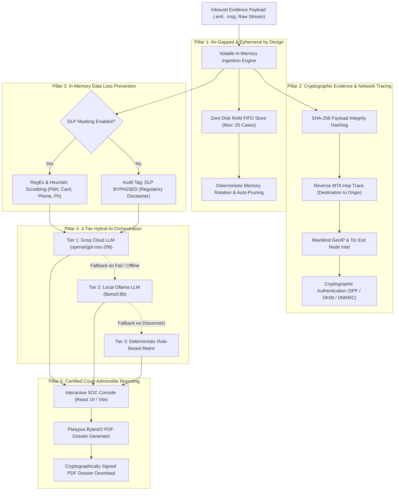

# ⚡ VAJRA — Zero-Database Air-Gapped Forensic Email Intelligence Platform (SIH26106)
> **Smart India Hackathon (SIH 2026) | Problem Statement: SIH26106**  
> **Offline-First / Air-Gapped Digital Forensic Intelligence & Threat Detection System**

> [!IMPORTANT]
> **Evaluators & Judges**: For an end-to-end, copy-paste evaluation guide covering both Windows (CMD & PowerShell) and Linux environments, see **[HOW-TO-RUN.md](HOW-TO-RUN.md)**.
> For deep technical architecture specifications, engineering logs, and defense rubrics, see **[documents/DEV_LOGS.md](documents/DEV_LOGS.md)**.

---

## 🎯 Executive Summary

Modern enterprise email threats have evolved past conventional signature detection. Attackers deploy multi-stage social engineering, coercive psychological urgency, dynamic brand typosquatting, deceptive Unicode display domains, and multimodal QR-code ("quishing") payloads embedded inside PDFs and high-resolution images. Simultaneously, digital forensics teams face strict legal and compliance mandates (GDPR, HIPAA, and DPDP) that prohibit writing sensitive, un-sanitized communication payloads to persistent hard drives.

**VAJRA** (*The Divine Forensic Thunderbolt*) is a high-assurance, zero-database email forensic intelligence platform engineered specifically for air-gapped security operations centers (SOC) and cybercrime investigative units:
- **Zero Persistent Disk Footprint:** 100% of payload parsing, routing tracing, threat scoring, and case storage executes in volatile, thread-safe RAM.
- **Strict In-Memory Data Privacy:** Integrated Data Loss Prevention (DLP) sanitizes payment cards, Aadhaar/SSNs, phone numbers, and PII before passing data to external reasoning models.
- **Cryptographic Chain of Custody:** Generates verifiable SHA-256 evidence hashes and streams court-admissible ReportLab Platypus PDF forensic dossiers directly from memory.
- **Dual SOC & Executive Views:** Deep technical reverse-hop telemetry for Level 2/3 SOC analysts alongside plain-English risk narratives and boundary gateway advisories for executives.

---

## 🏛️ Architectural Pillars



### 1. Air-Gapped & Ephemeral by Design (Dual-Layer Memory Protection)
- **Zero Disk Writes:** Inbound emails, parsed MIME structures, extracted attachments, and visual fragments are parsed and detonated exclusively within volatile memory.
- **Layer 1 — Circular FIFO Bound (Max 25):** Active cases reside in a thread-safe in-memory queue protected by concurrency locks. Bounding capacity to 25 cases strictly prevents memory leaks and out-of-memory crashes on resource-constrained cloud containers (e.g., AWS EC2/ECS/Fargate), automatically rotating out older records without disk persistence.
- **Layer 2 — On-Demand Cryptographic Memory Wipe (`DELETE /api/v1/cases`):** Operators can immediately zeroize all volatile evidence held in RAM via the REST API or the "Flush RAM Queue" button on the SOC Dashboard, verifying zero residual forensic remnants to satisfy strict air-gapped forensic hygiene standards.
- **Browser Session Ephemerality:** Browser refreshes (`F5`) automatically trigger `beforeunload` volatile state cleanup, landing operators cleanly on the Intake / Upload screen without cached report residue.

### 2. Cryptographic Evidence Chain of Custody
- **SHA-256 Evidence Hashing:** The exact raw byte sequence of every ingested email is cryptographically hashed at the moment of entry, establishing strict chain-of-custody verification.
- **Reverse MTA Hop Reconstruction:** Traces upstream `Received` headers from the final recipient gateway backwards to the earliest external public IP, neutralizing forged internal headers.
- **Local Threat Intelligence:** Integrates offline MaxMind `GeoLite2-City` and `GeoLite2-ASN` databases alongside an in-memory Tor exit node feed for real-time origin attribution.
- **SPF, DKIM & DMARC Matrix:** Directly validates envelope sender signatures, public key cryptographic alignments, and domain authentication policies.

### 3. In-Memory Data Loss Prevention (DLP)
- **Real-Time Regulatory Sanitization:** Scans email headers and body content for sensitive financial instruments (Luhn-verified credit/debit cards), government identification numbers (Aadhaar, SSN), and contact numbers.
- **Volatile Pre-Inference Masking:** Redacts matching substrings (`[REDACTED_CREDIT_CARD]`, `[REDACTED_PHONE]`) *prior* to neural network analysis.
- **Compliance Audit Logging:** When DLP is toggled off by an investigator, the generated dossier flags an explicit `DLP BYPASSED` regulatory liability disclaimer.

### 4. 3-Tier Hybrid AI Orchestration
- **Tier 1 (Cloud Ultra-Low Latency):** Groq Cloud inference utilizing `openai/gpt-oss-20b` (or configured models) for deep contextual reasoning, psychological lure deconstruction, and threat explanation in under 500ms.
- **Tier 2 (Local Air-Gapped LLM):** Automatic failover to local Ollama endpoints (`llama3:8b`) for high-security facilities operating with severed external uplinks.
- **Tier 3 (Deterministic Heuristic Matrix):** A zero-dependency mathematical scoring ruleset guaranteeing 100% operational uptime and immediate threat scoring even during complete network or inference outages.

### 5. Certified Court-Admissible Reporting
- **ReportLab Platypus Engine:** Generates high-density, multi-page forensic dossiers streamed directly as raw in-memory bytes (`BytesIO`) via `GET /api/v1/cases/{case_id}/pdf`.
- **Digital Evidence Artifacts:** Each PDF dossier features UTC timestamps, SHA-256 evidence hashes, complete MTA hop routing tables, multimodal quishing breakdowns, and forensic engine provenance watermarks.

---

## 🧰 Technology Stack

```
VAJRA PLATFORM
├── BACKEND (Python 3.10+ / FastAPI)
│   ├── Architecture: Asynchronous REST Engine (FastAPI + Uvicorn ASGI)
│   ├── Memory Storage: Thread-Safe Volatile RAM FIFO Case Store (Capacity: 25)
│   ├── MIME Parsers: Python email policy, mail-parser, extract-msg (RFC 5322 & Outlook MSG)
│   ├── Threat Intelligence: MaxMind GeoLite2 City & ASN (MMDB), Tor Exit Node Cache
│   ├── Multimodal Detonation: pypdf, pdfminer.six, pyzbar, OpenCV
│   ├── Report Generation: ReportLab Platypus (Streaming BytesIO, Zero Disk Writes)
│   └── AI Orchestrator: Groq Cloud SDK, Ollama REST Client, Deterministic Penalty Engine
│
└── FRONTEND (React 19 / Vite / Tailwind CSS v4)
    ├── Tooling: Vite 8.2, Oxlint (0 Warnings, 0 Errors)
    ├── Component Architecture: React 19, Lucide-React
    ├── Styling: Tailwind CSS v4 (SOC Cyberpunk Dark Glassmorphism)
    ├── Real-Time Telemetry: Animated In-Memory Threat Gauges, Hex Dumps & Routing Tables
    └── Visual Effects: HTML5 Procedural Particle Canvas System
```

---

## 🚀 Rapid Evaluation Launch

For detailed step-by-step instructions for Windows (CMD & PowerShell) and Linux, refer to **[HOW-TO-RUN.md](HOW-TO-RUN.md)**.

### Quick Commands Summary

```bash
# 1. Start Forensic Backend (Terminal 1)
cd backend
python -m venv myenv
.\myenv\Scripts\activate            # Windows CMD: myenv\Scripts\activate.bat
pip install -r requirements.txt
python scripts/download_geoip.py    # Verify / download GeoIP MMDBs
uvicorn app.main:app --reload --host 127.0.0.1 --port 8000

# 2. Start SOC Frontend (Terminal 2)
cd frontend
npm.cmd install                     # or npm install
npm.cmd run dev                     # or npm run dev
```

### Verified Local Endpoints
- **SOC Web Dashboard:** [http://localhost:5173](http://localhost:5173)
- **Interactive OpenAPI / Swagger Docs:** [http://localhost:8000/docs](http://localhost:8000/docs)
- **Engine Diagnostics & Telemetry:** [http://localhost:8000/health](http://localhost:8000/health)
- **Emergency Memory Purge API:** `DELETE http://localhost:8000/api/v1/cases`

---

## 📑 Repository Structure & Documentation Links

```
D:\SIH_Final_Workspace
├── backend/
│   ├── app/
│   │   ├── analyzers/        # PDF engine, QR quishing engine, text analyzers
│   │   ├── api/v1/           # REST routes (/upload, /raw, /cases, /cases/{id}/pdf)
│   │   ├── core/             # Configuration & constant matrices
│   │   ├── parsers/          # EML, MSG, and reverse MTA header parsing engines
│   │   ├── services/         # Risk scorer, DLP shield, ReportLab PDF generator, AI orchestrator
│   │   └── storage/          # Thread-safe in-memory FIFO case store
│   ├── data/                 # MaxMind GeoIP MMDB files & Tor exit node feeds
│   ├── scripts/              # download_geoip.py automated installer
│   └── tests/                # Pytest forensic test suites
├── frontend/
│   ├── src/
│   │   ├── components/       # Header, Dashboard, SimpleView, TechnicalView, UploadState
│   │   └── utils/            # pdfExport.js certified PDF export utility
│   └── package.json          # React 19 + Vite dependencies & build scripts
├── documents/
│   └── DEV_LOGS.md           # Engineering logs, architectural decisions & evaluation rubrics
├── HOW-TO-RUN.md             # Complete step-by-step evaluator demonstration runbook
└── README.md                 # System overview and high-value pitch documentation
```

---

## ⚖️ License & Ethical Disclosure

This project is developed for the **Smart India Hackathon (SIH 2026)** under Problem Statement **SIH26106**.  
Licensed under the [MIT License](LICENSE). Built strictly for defensive forensics, cybercrime investigation, and security operations center threat attribution.