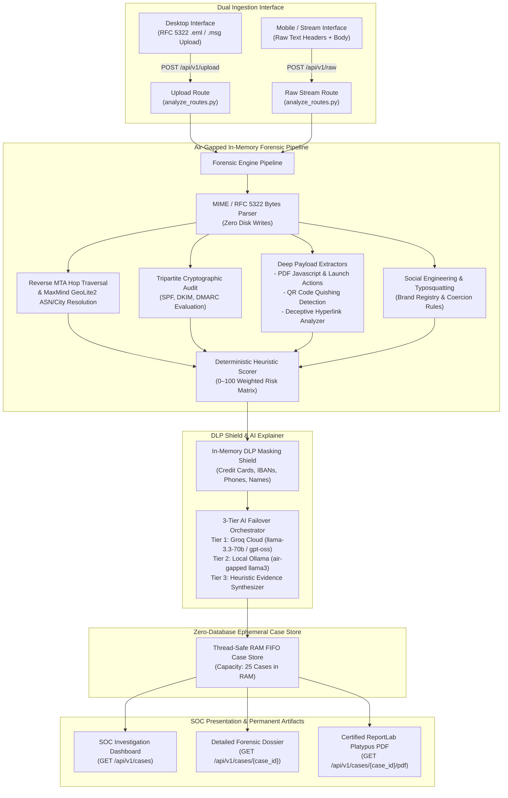

# 🛡️ VAJRA Forensic Platform — Architecture & Engineering Specifications
> **Smart India Hackathon (SIH 2026) | Problem Statement: SIH26106**  
> **Offline-First / Air-Gapped Zero-Database Forensic Email Intelligence Platform**

---

## 🏛️ System Architecture Overview

---

## 📋 Engineering Milestones & Changelog

### Phase 1: Core Architecture & In-Memory Foundation
- Decoupled into `frontend/` (React + Vite + Tailwind CSS) and `backend/` (FastAPI + Python 3.10+).
- Enforced zero-database hygiene: all email payloads, parsed structures, attachments, and cases live strictly in volatile memory.

### Phase 2: Reverse MTA Hop Traversal & Geolocation
- Engineered reverse hop parser traversing `Received` headers from internal targets back to origin MTA.
- Integrated MaxMind `GeoLite2-City` and `GeoLite2-ASN` MMDB readers with Tor exit-node cache lookup.

### Phase 3: Cryptographic & DNS Authentication Engine
- Audit of upstream MTA claims (`Authentication-Results`, `Received-SPF`, `DKIM-Signature`).
- Independent verification engine for SPF DNS TXT queries, DKIM cryptographic signature validation, and DMARC policy enforcement.

### Phase 4: Multimodal In-Memory Payload Detonation
- **PDF Engine**: In-memory inspection of PDF streams for `/JavaScript`, `/Launch`, embedded URLs, and embedded images.
- **QR Engine (Quishing)**: Automatic extraction and OpenCV decoding of embedded QR codes to unmask phishing redirectors.
- **Deceptive Hyperlink Engine**: Detection of visual anchor text mimicking legitimate brands while `href` targets malicious domains.

### Phase 5: Deterministic Scoring & Brand Registry
- 0–100 risk scoring matrix with itemized penalties and transparent threat verdict tiers (`SAFE`, `SUSPICIOUS`, `MALICIOUS`).
- Levenshtein-distance typosquatting detector cross-referencing high-value targets (PayPal, Microsoft, Google, banks).

### Phase 6: Privacy-Preserving DLP Shield & 3-Tier AI Failover
- Local regex-based PII redactor anonymizing credit cards, IBANs, phone numbers, and names prior to LLM reasoning.
- 3-tier automatic failover orchestrator:
  1. Groq Cloud Ultra-Low Latency Inference.
  2. Local Ollama LLM endpoint (for air-gapped deployments).
  3. Deterministic heuristic evidence synthesizer fallback.

### Phase 7: Certified PDF Dossier Generator
- ReportLab Platypus digital forensic dossier generation streamed directly from memory buffer (`BytesIO`).
- Generates executive summaries, MTA hop routing tables, cryptographic signature proofs, and SHA-256 evidence integrity hashes.

### Phase 8: SOC Investigation Dashboard & Dual-Mode Ingestion
- Real-time SOC investigation dashboard querying active in-memory cases (`GET /api/v1/cases`).
- Responsive table with sorting, search, verdict filters, and one-click PDF exports.
- Dual ingestion routing:
  - **Desktop View**: RFC 5322 `.eml` / `.msg` file upload (`POST /api/v1/upload`).
  - **Mobile View**: Raw email MIME headers and plain text streaming (`POST /api/v1/raw`).
- Replaced all non-functional dummy quarantine buttons with actionable read-only SOC gateway advisories.
